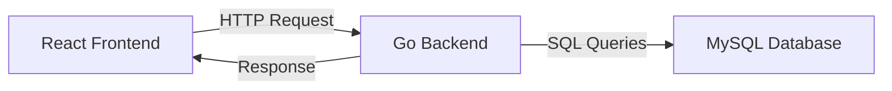

# 🏥 Smart Healthcare Appointment System (SHAS)

[](https://golang.org)
[](https://reactjs.org)
[](https://www.mysql.com)
[](LICENSE)
[](https://github.com/MotionProgramming/Smart-Healthcare-Appointment-System)

**Developer:** Md Abdullah Rajeb (MotionProgramming)  

**Status:** Not started / Ready to begin  

**Architecture:** Go Backend + Modern React Frontend

---

## 📑 Table of Contents

- [Project Overview](#-project-overview)
- [Architecture & Flow](#️-architecture--flow)
- [Core Objectives](#-core-objectives)
- [Technology Stack](#️-technology-stack)
- [Prerequisites](#-prerequisites)
- [Quick Start Guide](#️-quick-start-guide)
- [Roadmap](#-roadmap)
- [User Roles & Permissions](#-user-roles--permissions)
- [Database Schema](#️-database-schema)
- [API Endpoints](#-api-endpoints)
- [Testing & Validation](#-testing--validation)
- [Security & Best Practices](#️-security--best-practices)
- [Contributing](#-contributing)
- [License & Usage](#-license--usage)
- [Contact & Support](#-contact--support)

---

## 📋 Project Overview

**SHAS** is a full-stack healthcare appointment management platform.

**Primary Goals:**

- Simplify scheduling for patients and doctors
- Secure authentication and role-based access control
- Real-time appointment booking with conflict prevention
- Responsive React frontend + Go backend

---

## 🏗️ Architecture & Flow

**System Architecture:**

```
+-------------------+          +--------------------+
|                   |   HTTP   |                    |
|    React Frontend | <------> |     Go Backend     |
|  (SPA + Tailwind) |          | (Gorilla Mux, JWT)|
+-------------------+          +--------------------+
                                     |
                                     | SQL
                                     v
                               +-------------+
                               |  MySQL DB   |
                               |  3NF Schema |
                               +-------------+
```

**Components & Flow:**

1. **Frontend (React + Tailwind CSS)**
   - Responsive UI for patients, doctors, and admins
   - Routing, form validation, and API request handling (Axios)

2. **Backend (Go + Gorilla Mux)**
   - RESTful API server: authentication, appointments, user management
   - JWT authentication and RBAC for secure access
   - Goroutines for concurrent request handling

3. **Database (MySQL 8+)**
   - Stores users, doctors, appointments, availability, and audit logs
   - 3NF normalized schema ensures data integrity and efficient queries
   - ACID transactions prevent conflicts and maintain consistency

**Patient Appointment Booking Flow:**

1. Patient selects a doctor and time slot from the frontend
2. React frontend sends a POST request to `/api/patient/appointments`
3. Go backend:
   - Validates JWT and patient role
   - Checks doctor availability
   - Creates appointment within a transaction
4. Backend responds (success/failure)
5. Frontend updates UI

**System Flow Diagram:**



---

## 🎯 Core Objectives

1. **Scheduling Efficiency**
   - Conflict-free appointment management
   - Multi-doctor & multi-department support
   - Real-time availability updates

2. **Security & Compliance**
   - JWT authentication + bcrypt password hashing
   - Role-Based Access Control (RBAC)
   - SQL injection prevention and input validation

3. **Performance & Reliability**
   - Concurrency with Goroutines
   - DB connection pooling & ACID transactions
   - 3NF normalized MySQL schema

4. **User Experience**
   - Intuitive dashboards
   - Responsive web and mobile design
   - Real-time notifications

---

## 🛠️ Technology Stack

**Backend:** Go, Gorilla Mux, JWT, bcrypt, MySQL  
**Frontend:** React 18+, Tailwind CSS, React Router, Axios  
**Database:** MySQL 8+, 3NF schema  
**Tools:** Git, VS Code, Postman, Docker (optional)

---

## 📌 Prerequisites

### Backend Requirements

- Go 1.22+
- MySQL 8+ or PostgreSQL
- Redis (recommended for caching and session management in production)

### Frontend Requirements

- Node.js 18+
- npm 9+

### Other Tools

- Git
- Docker & Docker Compose (recommended for local development and production)
- Postman or Swagger UI (for API testing)

### Recommended Browser

- Latest version of Chrome, Firefox, Edge, or Safari

**Environment Variables:**

**Backend `.env`**

```bash
DB_HOST=localhost
DB_PORT=3306
DB_NAME=healthcare_db
DB_USER=root
DB_PASSWORD=your_secure_secret_key
JWT_SECRET=your_secure_secret_key_minimum_32_characters
JWT_EXPIRY=24h
SERVER_PORT=8080
CORS_ALLOWED_ORIGINS=http://localhost:3000
ENV=development
```

**Frontend `.env`**

```bash
REACT_APP_API_URL=http://localhost:8080/api
REACT_APP_ENV=development
```

> ⚠️ **Important:** Use a secure, randomly generated `JWT_SECRET` in production.

---

## ⏱️ Quick Start Guide

### 1️⃣ Clone Repository

```bash
git clone https://github.com/MotionProgramming/Smart-Healthcare-Appointment-System.git
cd Smart-Healthcare-Appointment-System
```

### 2️⃣ Database Setup

```bash
mysql -u root -p
CREATE DATABASE healthcare_db CHARACTER SET utf8mb4 COLLATE utf8mb4_unicode_ci;
USE healthcare_db;
SOURCE backend/database/schema.sql;
EXIT;
```

### 3️⃣ Backend Setup

```bash
cd backend
go mod download
cp .env.example .env
# Update DB credentials in .env
go run cmd/server/main.go
# Backend runs at http://localhost:8080
```

### 4️⃣ Frontend Setup

```bash
cd frontend
npm install
cp .env.example .env
npm start
# Frontend runs at http://localhost:3000
```

### 5️⃣ First Access

**Default Admin:**

```
Email: admin@shas.com
Password: Admin@123
```

**Important:** Change the default password immediately after first login.

---

## 📈 Roadmap

**Phase 1: Core System (✅ Ready to Start)**

- Appointment booking, JWT auth, RBAC, MySQL integration, React UI

**Phase 2: Enhancements (🚧 Planned)**

- Email notifications, automated reminders, advanced search, analytics, mobile responsiveness

**Phase 3: AI Integration (🤖 Future)**

- ML-based slot suggestions, symptom-based doctor matching, AI chatbot, predictive analytics

**Phase 4: Advanced Features (🚀 Long-term)**

- Telemedicine, payment gateway, native mobile apps, multi-language support, EHR integration

---

## 👥 User Roles & Permissions

| Feature             | Patient | Doctor | Admin |
|---------------------|:-------:|:------:|:-----:|
| Register            | ✓       | ✗      | ✗     |
| Login               | ✓       | ✓      | ✓     |
| View/Edit Profile   | ✓       | ✓      | ✓     |
| Book Appointment    | ✓       | ✗      | ✓     |
| Update Status       | ✗       | ✓      | ✓     |
| Manage Users        | ✗       | ✗      | ✓     |
| Reports & Analytics | ✗       | ~      | ✓     |

> **Legend:** ✓ = Allowed | ✗ = Not Allowed | ~ = Partial/Restricted Access

---

## 🗄️ Database Schema

**Core Tables:**

- `users` - All user accounts
- `doctors` - Doctor-specific information
- `appointments` - Unique doctor-time slot bookings
- `doctor_availability` - Weekly schedules
- `audit_logs` - Critical operation tracking

---

## 🔌 API Endpoints

### Authentication

```http
POST /api/auth/register
POST /api/auth/login
GET  /api/auth/profile
PUT  /api/auth/profile
POST /api/auth/change-password
```

### Patient

```http
GET    /api/patient/appointments
POST   /api/patient/appointments
PUT    /api/patient/appointments/:id
DELETE /api/patient/appointments/:id
GET    /api/patient/doctors
GET    /api/patient/doctors/:id/slots
```

### Doctor

```http
GET  /api/doctor/appointments
PUT  /api/doctor/appointments/:id/status
POST /api/doctor/availability
GET  /api/doctor/statistics
```

### Admin

```http
GET    /api/admin/users
POST   /api/admin/users
PUT    /api/admin/users/:id
DELETE /api/admin/users/:id
GET    /api/admin/doctors
GET    /api/admin/appointments
GET    /api/admin/statistics
GET    /api/admin/audit-logs
```

---

## 🧪 Testing & Validation

- **Backend:** `go test ./...`
- **Frontend:** `npm test`
- **Manual Testing:** Authentication, appointment booking, RBAC, data integrity

---

## 🛡️ Security & Best Practices

- JWT authentication + bcrypt password hashing
- Role-based access control (RBAC)
- Input validation & SQL injection prevention
- ACID transactions & unique constraints
- Comprehensive audit logging

---

## 🤝 Contributing

1. Fork the repository → Create a branch → Commit → PR
2. Follow Go & React best practices
3. Add tests for new features
4. Update documentation

---

## 📄 License & Usage

### Educational & Portfolio Use

- ✅ Free for learning, portfolio, or academic projects
- ✅ Modify, experiment, and demonstrate freely

### Commercial Use

- ⚠️ Requires explicit permission

### Disclaimer

- Academic project, not production-ready
- Not HIPAA compliant
- No liability for misuse

---

## ⚠️ Production Readiness Notice

Before deploying to production:

- ✅ Complete professional security audit
- ✅ Implement comprehensive logging and monitoring
- ✅ Set up automated backups with encryption
- ✅ Configure proper rate limiting and DDoS protection
- ✅ Enable database replication for high availability
- ✅ Conduct load testing with realistic transaction volumes
- ✅ Implement disaster recovery procedures

---

## 📞 Contact & Support

**Developer:** Md Abdullah Rajeb

- GitHub: [@MotionProgramming](https://github.com/MotionProgramming)
- Email: [mdabdullahrajeb90@gmail.com](mailto:mdabdullahrajeb90@gmail.com)
- Project: [SHAS Repository]([https://github.com/MotionProgramming/Smart-Healthcare-Appointment-System](https://github.com/MotionPrograming/Smart-Healthcare-Appointment-System))

---

